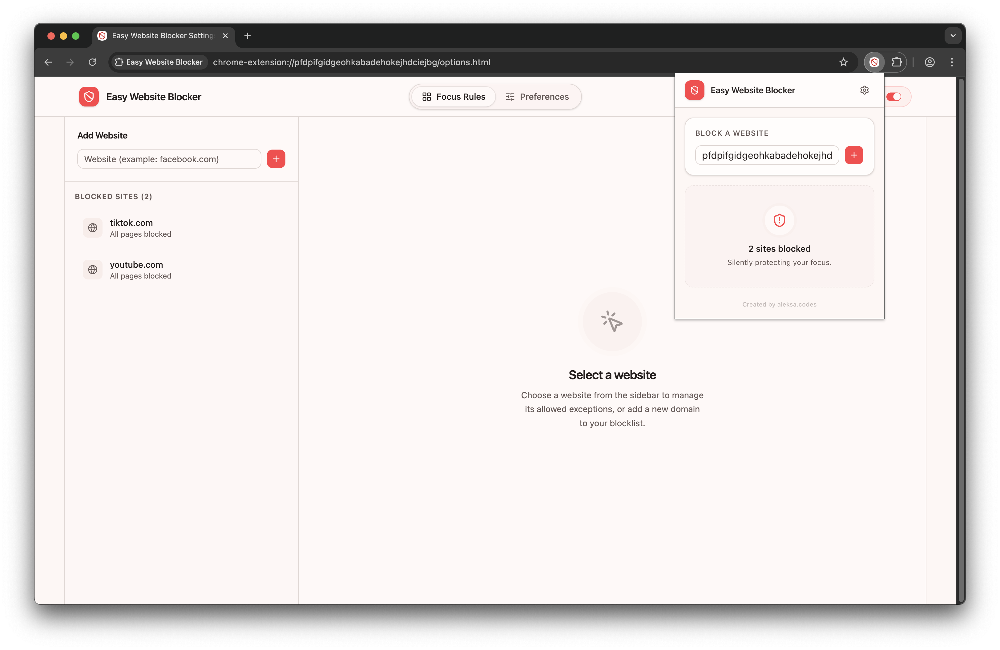

# Easy Website Blocker 🚫

A powerful Chrome extension that helps you stay focused by blocking distracting websites while allowing specific pages through customizable exceptions. Perfect for maintaining productivity while keeping essential pages accessible.



## Features

- 🚫 **Smart Website Blocking**
  - Block entire domains with one click
  - Customizable path exceptions for each blocked site
  - Instant blocking without browser restart
- 🎯 **Flexible Exceptions**

  - Allow specific pages or sections within blocked sites
  - Support for complex URL patterns
  - Easy management through intuitive UI

- ⚡ **User Experience**
  - Quick access through popup menu
  - Detailed options page for fine-tuning
  - Clean blocked page interface
- 🔒 **Security & Performance**
  - Built on Chrome's Manifest V3
  - Uses declarativeNetRequest for efficient blocking
  - No external dependencies for blocking logic
  - Local storage for privacy

## Tech Stack

### Core Technologies

- **React 18** - UI framework with TypeScript
- **Vite** - Next-generation frontend tooling
- **Chrome Extension APIs** - Manifest V3 compatible

### UI Components & Styling

- **Shadcn/ui** - High-quality React components built on Radix UI
- **Tailwind CSS** - Utility-first CSS framework
- **Lucide React** - Beautiful hand-crafted icons
- **Radix UI** - Unstyled, accessible components

### Development & Build Tools

- **TypeScript** - Static typing and modern JavaScript features
- **ESLint** - Code linting and best practices
- **Prettier** - Code formatting
- **CRXJS** - Vite plugin for Chrome extension development

## Getting Started

### Prerequisites

- Node.js (v16 or higher)
- npm or yarn
- Google Chrome browser

### Installation

1. Clone the repository:

```bash
git clone https://github.com/aleksa-codes/easy-website-blocker.git
cd easy-website-blocker
```

2. Install dependencies:

```bash
npm install
# or
yarn install
```

3. Build the extension:

```bash
npm run build
# or
yarn build
```

### Development Mode

Start the development server with hot reload:

```bash
npm run dev
# or
yarn dev
```

### Loading in Chrome

1. Open Chrome and navigate to `chrome://extensions/`
2. Enable "Developer mode" in the top right
3. Click "Load unpacked" and select the `dist` folder

## Project Structure

```
easy-website-blocker/
├── src/
│   ├── components/          # Reusable UI components
│   │   ├── ui/             # Shadcn/ui components
│   │   └── ...
│   ├── popup/              # Extension popup interface
│   ├── options/            # Options page
│   ├── blocked/            # Blocked page interface
│   ├── utils/              # Utility functions
│   ├── types/              # TypeScript types
│   └── background.ts       # Service worker
├── public/                 # Static assets
│   └── rules/             # Blocking rules
└── manifest.json          # Extension manifest
```

## Usage

### Blocking a Website

1. Click the extension icon
2. Enter the domain (e.g., facebook.com)
3. Click the block button

### Adding Exceptions

1. Go to the options page
2. Select the blocked website
3. Add path exceptions (e.g., facebook.com/groups/productivity)

### Managing Sites

- Use the popup for quick blocking/unblocking
- Visit the options page for detailed management
- Toggle visibility of blocked sites in popup

## Contributing

We welcome contributions! Please follow these steps:

1. Fork the repository
2. Create your feature branch (`git checkout -b feature/AmazingFeature`)
3. Commit your changes (`git commit -m 'Add some AmazingFeature'`)
4. Push to the branch (`git push origin feature/AmazingFeature`)
5. Open a Pull Request

### Development Guidelines

- Follow the existing code style
- Add TypeScript types for new features
- Update tests if applicable
- Document new features or changes

## Building for Production

Create a production build:

```bash
npm run build
# or
yarn build
```

The built extension will be in the `dist` folder, ready for:

- Loading into Chrome
- Publishing to the Chrome Web Store

## Troubleshooting

Common issues and solutions:

- **Extension not blocking**: Check if the domain format is correct
- **Exceptions not working**: Ensure paths are properly formatted
- **Build errors**: Make sure all dependencies are installed

## License

This project is licensed under the MIT License - see the [LICENSE](LICENSE) file for details.

## Acknowledgments

- [Shadcn/ui](https://ui.shadcn.com/) for the beautiful UI components
- [CRXJS](https://crxjs.dev/vite-plugin) for the Vite plugin
- [Lucide](https://lucide.dev/) for the icons
- The Chrome Extensions team for Manifest V3

---

Made with ❤️ for productivity
