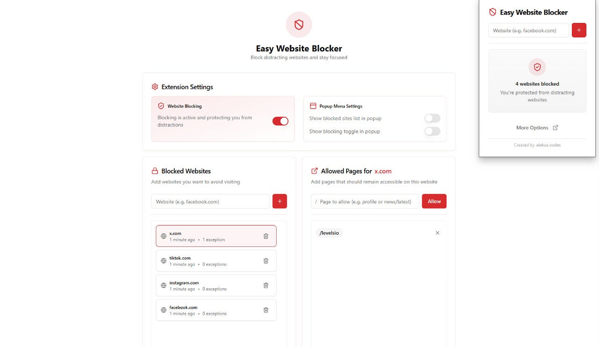

# Easy Website Blocker 🚫

Easy Website Blocker is a Chrome extension designed to help you stay focused by blocking distracting websites, while allowing specific pages through customizable exceptions. Perfect for maintaining productivity without sacrificing access to essential resources.



## ✨ Features

- **Smart Website Blocking**: Block entire domains with a single click
- **Flexible Exceptions**: Allow specific pages or sections within blocked sites
- **Instant Blocking**: No need to restart the browser for changes to take effect
- **Intuitive User Experience**: Quick access via popup menu and a detailed options page
- **Efficient & Secure**: Built on Chrome's Manifest V3 using declarativeNetRequest, with local storage for privacy

## 🛠️ Tech Stack

- **Frontend Framework**: React + TypeScript
- **Styling**: Tailwind CSS
- **UI Components**: shadcn/ui, Radix UI
- **Icons**: Lucide React
- **Build Tool**: Vite
- **Extension Framework**: Chrome Extensions API (Manifest V3)
- **Development Tools**: TypeScript, ESLint, Prettier, CRXJS for Vite

## 🚀 Getting Started

### Prerequisites

- Node.js (v16 or higher)
- npm or yarn
- Chrome browser

### Installation

1. Clone the repository:

   ```bash
   git clone https://github.com/aleksa-codes/easy-website-blocker.git
   cd easy-website-blocker
   ```

2. Install dependencies:

   ```bash
   npm install
   # or
   yarn install
   ```

3. Build the extension:

   ```bash
   npm run build
   # or
   yarn build
   ```

4. Load the extension in Chrome:
   - Open Chrome and navigate to `chrome://extensions/`
   - Enable "Developer mode" in the top right
   - Click "Load unpacked" and select the `dist` folder

## 💡 Usage

1. **Blocking a Website**: Click the extension icon, enter the domain (e.g., `facebook.com`), and click "Block."
2. **Adding Exceptions**: Go to the options page, select the blocked website, and add path exceptions (e.g., `facebook.com/groups/productivity`).
3. **Managing Blocked Sites**: Use the popup for quick blocking/unblocking, or visit the options page for detailed management.

## 🛠️ Project Structure

```
easy-website-blocker/
├── src/
│   ├── components/          # Reusable UI components
│   ├── popup/               # Extension popup interface
│   ├── options/             # Options page
│   ├── blocked/             # Blocked page interface
│   ├── utils/               # Utility functions
│   ├── types/               # TypeScript types
│   └── background.ts        # Service worker
├── public/                  # Static assets
│   └── rules/               # Blocking rules
└── manifest.json            # Extension manifest
```

## 🤝 Contributing

Contributions are welcome! Here's how you can help:

1. Fork the repository
2. Create your feature branch: `git checkout -b feature/AmazingFeature`
3. Commit your changes: `git commit -m 'Add some AmazingFeature'`
4. Push to the branch: `git push origin feature/AmazingFeature`
5. Open a Pull Request

### Development Guidelines

- Follow existing code styles and conventions
- Add TypeScript types for new features
- Test new features and update documentation as needed

## 📝 License

This project is licensed under the MIT License - see the [LICENSE](LICENSE) file for details.

---

<p align="center">Made with ❤️ by <a href="https://github.com/aleksa-codes">aleksa.codes</a></p>
